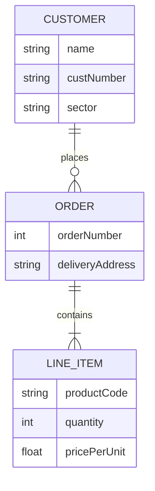

```mermaid

erDiagram
    CUSTOMER ||--o{ ORDER : places
    CUSTOMER {
        string name
        string custNumber
        string sector
    }
    ORDER ||--|{ LINE_ITEM : contains
    ORDER {
        int orderNumber
        string deliveryAddress
    }
    LINE_ITEM {
        string productCode
        int quantity
        float pricePerUnit
    }

```