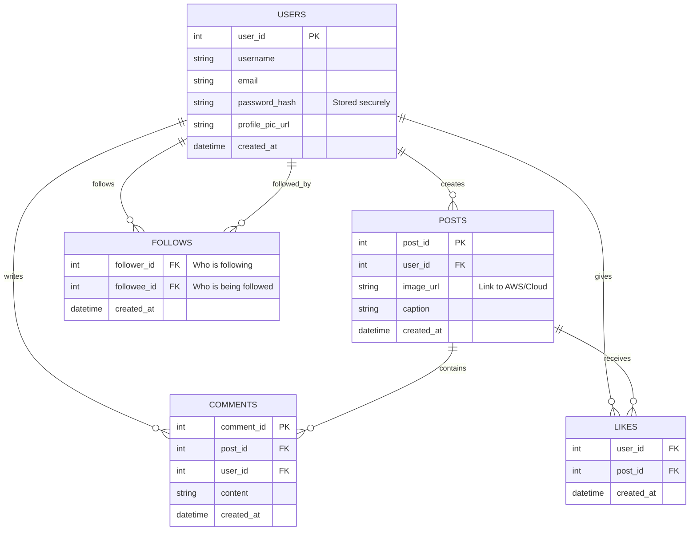

```mermaid

erDiagram
    USERS ||--o{ POSTS : creates
    USERS ||--o{ COMMENTS : writes
    USERS ||--o{ LIKES : gives
    POSTS ||--o{ COMMENTS : contains
    POSTS ||--o{ LIKES : receives
    USERS ||--o{ FOLLOWS : follows
    USERS ||--o{ FOLLOWS : followed_by

    USERS {
        int user_id PK
        string username
        string email
        string password_hash "Stored securely"
        string profile_pic_url
        datetime created_at
    }
    POSTS {
        int post_id PK
        int user_id FK
        string image_url "Link to AWS/Cloud"
        string caption
        datetime created_at
    }
    COMMENTS {
        int comment_id PK
        int post_id FK
        int user_id FK
        string content
        datetime created_at
    }
    LIKES {
        int user_id FK
        int post_id FK
        datetime created_at
    }
    FOLLOWS {
        int follower_id FK "Who is following"
        int followee_id FK "Who is being followed"
        datetime created_at
    }
```