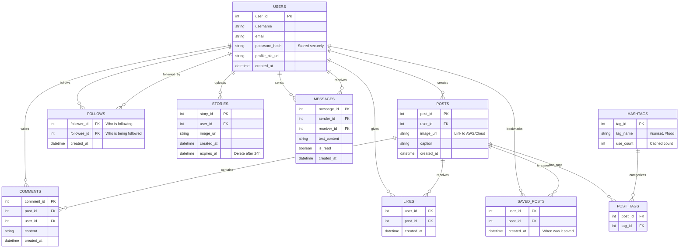

```mermaid

erDiagram
    %% EXISTING RELATIONSHIPS
    USERS ||--o{ POSTS : creates
    USERS ||--o{ COMMENTS : writes
    USERS ||--o{ LIKES : gives
    POSTS ||--o{ COMMENTS : contains
    POSTS ||--o{ LIKES : receives
    USERS ||--o{ FOLLOWS : follows
    USERS ||--o{ FOLLOWS : followed_by

    %% NEW RELATIONSHIPS (Added so lines connect)
    USERS ||--o{ STORIES : uploads
    USERS ||--o{ SAVED_POSTS : bookmarks
    POSTS ||--o{ SAVED_POSTS : is_saved
    USERS ||--o{ MESSAGES : sends
    USERS ||--o{ MESSAGES : receives
    POSTS ||--o{ POST_TAGS : has_tags
    HASHTAGS ||--o{ POST_TAGS : categorizes

    %% ENTITIES
    USERS {
        int user_id PK
        string username
        string email
        string password_hash "Stored securely"
        string profile_pic_url
        datetime created_at
    }
    POSTS {
        int post_id PK
        int user_id FK
        string image_url "Link to AWS/Cloud"
        string caption
        datetime created_at
    }
    COMMENTS {
        int comment_id PK
        int post_id FK
        int user_id FK
        string content
        datetime created_at
    }
    LIKES {
        int user_id FK
        int post_id FK
        datetime created_at
    }
    FOLLOWS {
        int follower_id FK "Who is following"
        int followee_id FK "Who is being followed"
        datetime created_at
    }
    STORIES {
        int story_id PK
        int user_id FK
        string image_url
        datetime created_at
        datetime expires_at "Delete after 24h"
    }
    SAVED_POSTS {
        int user_id FK
        int post_id FK
        datetime created_at "When was it saved"
    }
    MESSAGES {
        int message_id PK
        int sender_id FK
        int receiver_id FK
        string text_content
        boolean is_read
        datetime created_at
    }
    HASHTAGS {
        int tag_id PK
        string tag_name "#sunset, #food"
        int use_count "Cached count"
    }
    POST_TAGS {
        int post_id FK
        int tag_id FK
    }
```